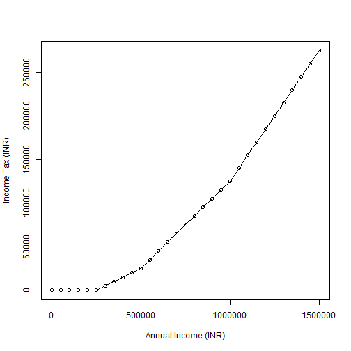

## Course Project

* This is the final presentation for the Course Project of the "Developing data products" course, as part of the "Data Science specialization".
* The project consists in two activities, as given below:
    + Create a Shiny application
    + Create a presentation using Slidify

--- .class #id 

## Calculation of Income Tax in India
* For this assignment, I've developed an application that can calculate the income tax based on the inputted annual income figure.
* Income tax in India is calculated based on income slabs.
* Tax rate is low for low income groups, and tax rate increases for high income groups.
* Income tax rates details can be found at http://www.incometaxindia.gov.in/charts%20%20tables/tax%20rates.htm

--- .class #id 

## Tax Rate Slabs

* For this project, tax rate slabs are given below for reference.

Taxable Income (INR)  | Tax Rate 
--------------  | ------------- 
Up to Rs. 2,50,000    | Nil       
Rs. 250,000 to Rs. 500,000        | 10%       
Rs. 500,000 to Rs. 1,000,000        | 20% 
Above Rs. 1,000,000        | 30% 

--- .class #id 

## Income Tax Chart

